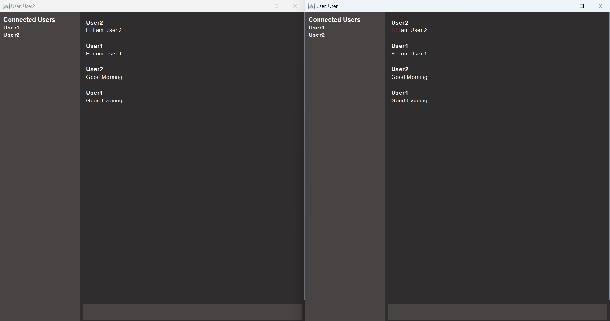

# 💬 Online Chat Application (Java WebSocket + STOMP + Swing Client)

This is a full-stack **real-time chat application** built using **Spring Boot WebSocket (STOMP protocol)** on the backend and a **JavaFX GUI client**. It supports multiple users chatting simultaneously with live message updates and connected user tracking.



---

## 🚀 Features

✅ Real-time communication using WebSocket + STOMP  
✅ Swing-based rich desktop UI  
✅ Displays connected users dynamically  
✅ Sends and receives JSON messages  
✅ Graceful connect/disconnect handling  
✅ Deployed backend on [Render](https://online-chat-application-hy1a.onrender.com)  

---

## 🛠️ Tech Stack

| Layer     | Technology                          |
|-----------|--------------------------------------|
| Backend   | Java, Spring Boot, WebSocket, STOMP |
| Frontend  | JavaSwing       |
| Deployment| Docker + Render.com                 |

> Please note: The server may take time to wake up if it's been inactive (Render free tier).
---
# For best experience, run locally by cloning this repo and following the instructions below
## 📦 How to Run locally

✅ Prerequisites
Make sure the following are installed:

- Java 17+ (Java 21 recommended)
- Maven (3.9.2 or greater)
- An IDE like IntelliJ (recommended) or Ecilpse

🚦 Steps to Run

- Clone the Repository (use following commands)
  
```bash
git clone https://github.com/Siddharth3271/Online-Chat-Application.git
cd Online-Chat-Application
```

- Open the project in IntelliJ IDEA.
- Go to [](src/main/java/com/siddh/Online_Chat_Application/client/MyStompClient.java)
- Change the Websocket server url in the client from [](https://online-chat-application-hy1a.onrender.com/ws) to [](ws://localhost:8081/ws)
- Run the backend server from [](src/main/java/com/siddh/Online_Chat_Application/OnlineChatApplication.java)
- Run the client server from [](src/main/java/com/siddh/Online_Chat_Application/client/App.java)

### 🧪 Running Multiple Client Instances (in IntelliJ)

To test two clients locally:

1. Open **Run/Debug Configuration Selector**.
2. Click on **Edit Configurations**.
3. Click `+` → Select **Application**.
4. Set the **Main class** to your App GUI class (e.g., `AppGUI`).
5. Name it something like `App2_Client`.
6. Apply and save.

Repeat this to launch both `AppGUI` and `App2_Client` and start chatting between them.


